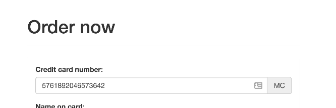

#  Inputy i formularze

> Wszystkie zadania rozwiązuj w przygotowanych do tego plikach.

Zadania rozwiązuj w pliku `app.js`, chyba, że w poleceniu podano inny plik.
Pamiętaj, żeby oddzielać zadania komentarzami i pisać czytelny, dobrze sformatowany kod.  

**Nie modyfikuj kodu HTML, chyba że w poleceniu jest napisane inaczej**.

**WAŻNE -  nie zmieniaj struktury/nazw plików oraz korzystaj z przygotowanych zmiennych**

Każde zadanie ma swój plik **HTML** i powinno być rozwiązane w osobnym pliku JavaScript (puste pliki są już przygotowane w odpowiednim folderze).

#### Zadanie 1 - rozwiązywane z wykładowcą

Walidacja karty kredytowej.  
Zadanie polega na walidacji kart kredytowych wpisywanych w formularz na stronie.  
**Walidacja ma następować w czasie rzeczywistym (czyli po wprowadzeniu każdej cyfry).**  
Nazwa karty ma być wpisana, jak tylko jest możliwe jej ustalenie.  
Poprawność karty ma być pokazana po wpisaniu odpowiedniej liczby cyfr.  



#### Zasady rozpoznawania kart:
1. Karty Visa zaczynają się od cyfry `4`.
2. Karty Mastercard zaczynają się od cyfry `5`.
3. Karty American Express zaczynają się od cyfry `3`.  
   Następną cyfrą musi być `4` lub `7`.

#### Zasady walidacji kart:
1. Karty Visa mają od `13` do `16` cyfr.
2. Karty Mastercard mają równo `16` cyfr.
3. Karty American Express mają równo `15` cyfr.

Zasady walidacji kart są uproszczone (nie powinniście ich stosować w rzeczywistych projektach).  
Jeżeli chcesz poznać prawdziwe zasady walidacji kart kredytowych, to są one opisane tutaj:  
https://en.wikipedia.org/wiki/Bank_card_number
https://en.wikipedia.org/wiki/Luhn_algorithm

-------------------------------------------------------------------------------

#### Zadanie 2

Na stronie znajduje się formularz do zamówienia.  
Jest w nim sekcja odpowiedzialna za wystawienie faktury.
1. Napisz kod JavaScript, który spowoduje, że sekcja ta jest widoczna tylko i wyłącznie wtedy,  
   kiedy zaznaczony jest checkbox `Faktura VAT`.

#### Zadanie 3

Na stronie znajduje się formularz do zamówienia pizzy.  
W formularzu znajduje się pole z checkboxami, w którym użytkownik może wybrać sobie dodatki.  
Cena każdego z dodatków jest trzymana w atrybucie ```data-price```.  

1. Napisz takie eventy, żeby po zaznaczeniu checkboxa wyświetlała się poprawna kwota zamówienia oraz po wysłaniu formularza wyświetlił się alert z wyliczoną kwotą.
2. Zwróć uwagę na dwa specjalne checkboxy:
   * `Wyczyść` powinien odznaczyć wszystkie opcje,
   * `Wszystkie dodatki` powinien zaznaczyć wszystkie opcje (poza `Wyczyść`).

#### Zadanie 4

Na stronie znajduje się `select` i 3 obrazki.
Każdy z obrazków jest przypisany do jednego z wyborów w polu `select`.
1. Napisz kod javaScript w taki sposób, żeby widoczny był tylko ten obrazek, który został wybrany.

#### Zadanie 5

Na stronie znajduje się formularz, który odsyła do strony ```http://api.coderslab.pl/showpost.php```.
Napisz walidację tego formularza w taki sposób, żeby wysyłany był tylko i wyłącznie wtedy, kiedy spełnione zostaną następujące warunki:

1. Email zawiera w sobie `@`.
2. Imię jest dłuższe niż `5` znaków.
3. Nazwisko jest dłuższe niż `5` znaków.
4. Hasło i hasło drugie są **identyczne**.
5. Checkbox **musi** być zaznaczony.

Warunek dla chętnych. Dodatkowe. Hasło ma mieć co najmniej pięć znaków (w tym co najmniej jedną liczbę i jedną literę).

Zauważ, jak dane wyświetlane są na stronie docelowej (jak ich nazwy są skorelowane z kodem HTML).  
Spróbuj pozmieniać atrybuty ```name``` i zobacz, jak się zmieniają wysyłane dane (np. sprawdź, co się stanie, jak dwa inputy mają taką samą nazwę).
Uwaga, jest to ważne miejsce współpracy frontendowców z backendowcami.

#### Zadanie 6

Na stronie znajduje się tablica z wynikami w lokalnych mistrzostwach piłkarskich.  
Poniżej znajduje się formularz, który wypełniają wszyscy sędziowie po ukończonych rozgrywkach.
1. Napisz kod JavaScript w taki sposób, żeby po wybraniu odpowiednich drużyn nastąpiła walidacja:  
   * Obie drużyny muszą być różne.
   * Liczba goli powinna być nieujemna.

Jeżeli formularz zostanie zweryfikowany poprawnie, odpowiednia informacja o wyniku spotkania powinna pojawić się w tablicy.
